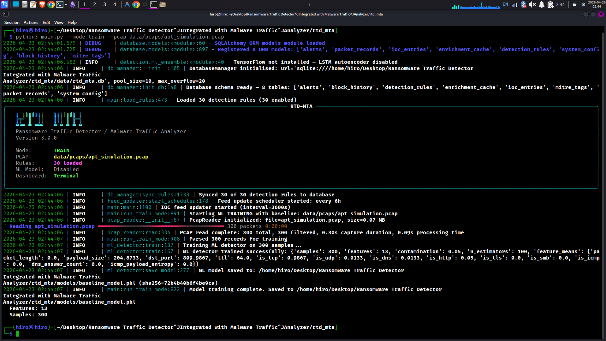

# RTD-MTA  Demo 3: ML Baseline Training Mode

**Tool:** Ransomware Traffic Detector / Malware Traffic Analyzer (RTD-MTA v3.0.0)  
**Demo Run Date:** 2026-04-23  
**Analyst:** Memonziel  
**Mode:** TRAIN  Unsupervised ML Baseline Modeling

---

## Why This Demo Matters

Signature-based detection has a ceiling. Every rule in RTD-MTA's ruleset  all 30 of them  requires someone to have seen the attack before, written a rule for it, and pushed it to production. Zero-days don't wait for that. Novel ransomware variants deliberately avoid known IOC signatures. Polymorphic loaders change their byte patterns on every execution.

This demo shows the other half of the detection stack: the unsupervised ML pipeline. You train it on what normal looks like. Then, in live or offline mode, anything that deviates mathematically from that baseline gets flagged  regardless of whether it matches any known signature. No prior knowledge of the threat required.

**Command run:**

```bash
python3 main.py --mode train --pcap data/pcaps/apt_simulation.pcap
```

---

## Screenshot  ML Training Run


---

## What the Output Shows, Line by Line

**Banner confirms `Mode: TRAIN`**  the pipeline skips all detection engines and alert generation. This run is purely about building the statistical model.

**`Starting ML TRAINING with baseline: data/pcaps/apt_simulation.pcap`**  
The PCAP being fed here is labeled as a baseline  meaning this is traffic you've decided represents "normal" network behavior. In a real deployment, you'd train on a clean capture from your environment: standard business hours traffic, known-good workstations, expected protocol distribution. The model learns what normal looks like from this data.

**`PCAP read complete: 300 total, 300 filtered, 0.30s capture  0.09s processing time`**  
All 300 packets parsed cleanly with zero drops. The 0.09s processing time is the raw feature extraction phase  pulling the 13 numerical features out of each packet before the model sees any of it.

**`Parsed 300 records for training`**  
Each packet becomes one row in the training matrix: 300 rows × 13 features. That matrix is what goes into the Isolation Forest algorithm.

**`Training ML detector on 300 samples...`**  
Isolation Forest begins fitting. This is the unsupervised learning step  no labeled data, no "this is malicious / this is benign" ground truth. The algorithm randomly partitions the feature space and measures how few cuts it takes to isolate each data point. Normal traffic clusters together and takes many cuts to isolate. Anomalies sit away from the cluster and isolate quickly.

**Training result:**

```
samples:       300
features:      13
contamination: 0.05
n_estimators:  100
feature_means: {
  packet_length:        0.0,
  payload_size:         204.8733,
  dst_port:             809.9867,
  ttl:                  64.0,
  is_tcp:               0.9867,
  is_udp:               0.0133,
  is_dns:               0.0133,
  is_http:              0.05,
  is_tls:               0.0,
  is_smb:               0.0,
  is_icmp_payload_entropy: 0.0
}
```

Each of those feature means is the model's learned definition of "normal." Let's read a few:

- **payload_size mean: 204.87**  Average packet payload in this baseline is ~205 bytes. In live mode, a packet carrying a 10MB payload would deviate significantly from this. Large payload anomalies are a classic ransomware exfiltration indicator.
- **dst_port mean: 809.98**  Average destination port in normal traffic is ~810. Ransomware often beacons on high non-standard ports (4444, 8443, 49152+). A sudden shift in the port distribution will move this feature far from the learned mean.
- **ttl mean: 64.0**  Standard TTL for most OS stacks. Crafted packets or tunneled traffic often deviate here.
- **is_tcp: 0.9867**  98.67% of baseline traffic is TCP. A sudden spike in UDP traffic would shift this feature and trigger an anomaly score.
- **contamination: 0.05**  The model is told to treat the top 5% most isolatable points in any future dataset as anomalies. This is the threshold you tune based on your environment's tolerance for false positives.
- **n_estimators: 100**  100 isolation trees in the ensemble. More trees = more stable anomaly scores, at the cost of compute time. 100 is standard for production use.

**`ML model saved to: .../models/baseline_model.pkl (sha256=72b4b40b6f4be9ca)`**  
The trained model is serialized to disk as a pickle file. The SHA-256 hash is logged at save time. This is supply chain integrity protection. If someone tampers with `baseline_model.pkl`  swaps it out for a backdoored model, for example  re-hashing the file before the next run will detect the mismatch. In an adversarial environment, model files are just as much an attack surface as detection rules.

**Final summary:**

```
Model training complete.
Features: 13
Samples:  300
```

---

## SOC Level Notes

**L1  What you need to know:**

When this model is active in live or offlinee ML-generated e mode, you'll salerts alongside signature alerts. The difference is the source: signature alerts say "this matched rule RTD-008." ML alerts say "this packet's feature vector is statistically far from the baseline." If you see an ML alert on a host that also has no signature hits, that's the scenario this was built for  a novel threat that no one has written a rule for yet. Escalate it.

**L2  Tuning the model:**

The `contamination=0.05` setting is the main knob. Set it too low and the model misses real anomalies. Set it too high and every slightly unusual packet triggers an alert. For a new deployment, 0.05 (5%) is a reasonable starting point. After 2-4 weeks of live operation, you pull the alert data, look at false positive rates, and retune. The SHA-256 hash on the model file means you have an audit trail of every model version ever deployed  if detection behavior changes unexpectedly, you can trace it back to a model change.

The 13 features the model trained on cover packet length, payload size, destination port, TTL, and protocol flags (TCP, UDP, DNS, HTTP, TLS, SMB, ICMP entropy). That's a reasonable feature set for network anomaly detection. The notable gaps  which would strengthen the model  are connection duration, inter-arrival time variance (which would help catch C2 beaconing), and byte entropy across the full payload (which would catch encrypted ransomware channels even without TLS handshakes).

**L3  Why Isolation Forest over other algorithms:**

Isolation Forest is the right choice for this use case for three reasons. First, it's unsupervised  you don't need labeled training data, which you almost never have in a fresh network deployment. Second, it scales linearly with dataset size, so retraining on a week's worth of PCAP doesn't become a compute problem. Third, it handles high-dimensional feature spaces well without overfitting, unlike k-means or DBSCAN which tend to collapse into trivial clusters when feature count climbs past 5-6.

The alternative would be an LSTM autoencoder  which RTD-MTA also supports (`TensorFlow not installed  LSTM autoencoder disabled` at startup). LSTMs capture temporal sequence patterns, which is better for detecting C2 beaconing (regular interval communication) but requires TensorFlow, more training data, and significantly more tuning time. Isolation Forest gets you anomaly detection immediately on 300 samples. For a prototype or initial deployment, that's the right tradeoff.

The SHA-256 integrity check on the serialized model is not a standard feature in most open-source security tools. That's a deliberate engineering decision. A compromised model file  one that's been tuned to suppress anomaly scores for specific traffic patterns  is a credible threat in a targeted attack scenario. Logging the hash at save time and verifying it at load time closes that vector.

---

_Report based on live terminal output captured on 2026-04-23._
