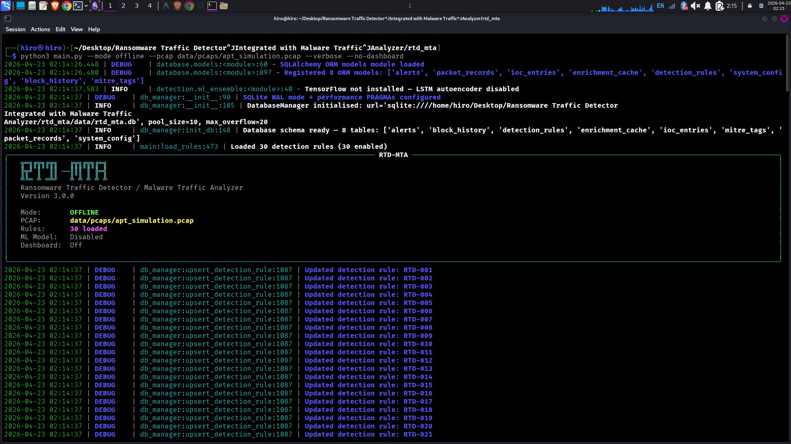
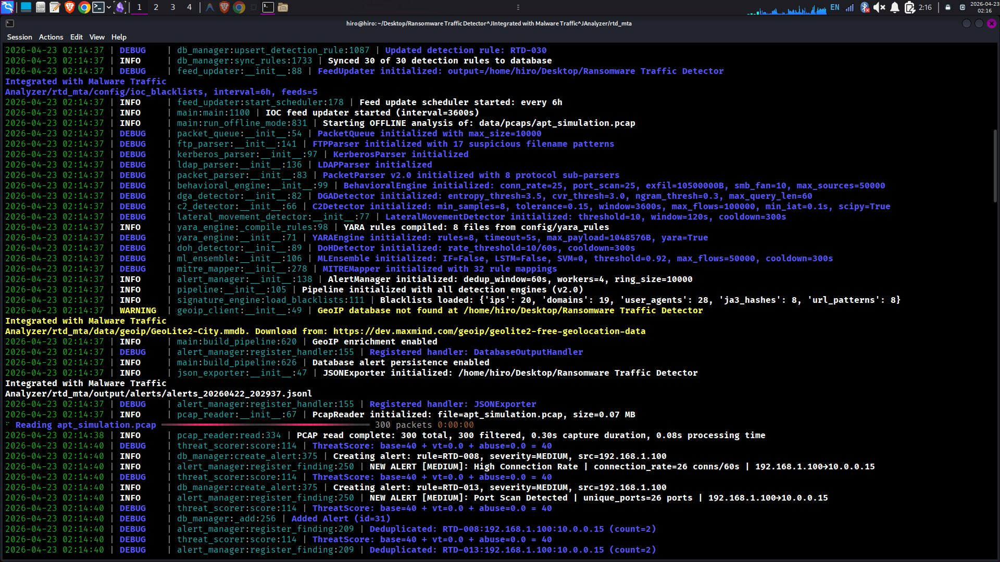
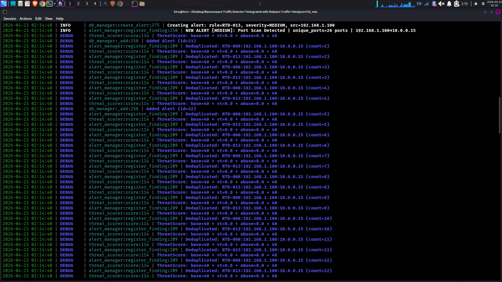
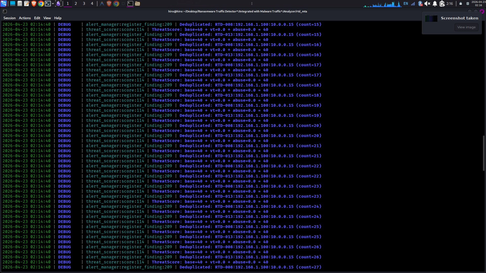
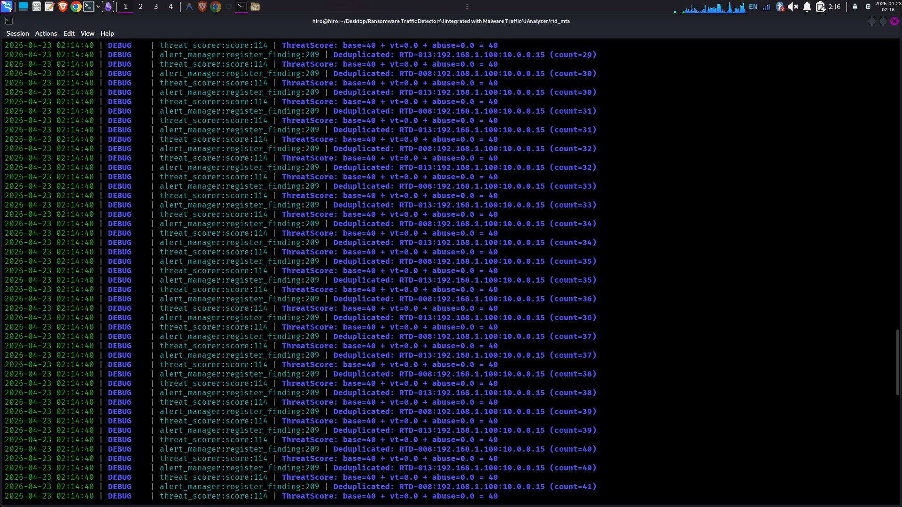
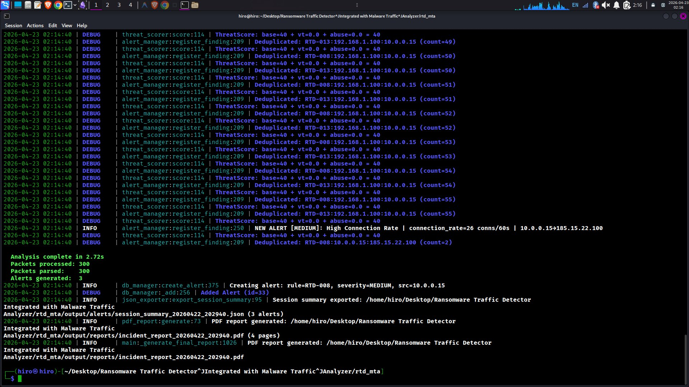

# RTD-MTA — SOC Analyst Observation Report

**Tool:** Ransomware Traffic Detector / Malware Traffic Analyzer (RTD-MTA v3.0.0)  
**Demo Run Date:** 2026-04-23  
**Analyst:** Manjil Katuwal  
**Mode Tested:** Offline PCAP Analysis (`apt_simulation.pcap`)

---

## What This Tool Actually Does

RTD-MTA is a multi-engine network traffic analysis platform built to detect ransomware behavior, malware C2 communication, and lateral movement — all in one pipeline. It can work against live traffic on a network interface or analyze saved PCAP files offline. The backbone is a set of 9 detection engines running in parallel: Behavioral, DGA, C2, Lateral Movement, YARA, DoH, ML Ensemble, Signature Matching, and MITRE ATT&CK mapping. Everything feeds into a single alert pipeline that deduplicates, scores, and persists findings into SQLite, exports JSON session summaries, and auto-generates a PDF incident report when the threat score crosses a threshold.

The `--help` output alone shows how much surface area this tool covers — live capture, offline PCAP, Zeek log ingestion, Elasticsearch export, Prometheus metrics, Sigma rule export, active response engine, and multi-channel notifications. This isn't a script. This is an analyst workstation in a single command.

---

## Demo Run: `--mode offline --verbose --no-dashboard`

**Full command executed:**

```bash
python3 main.py --mode offline --pcap data/pcaps/apt_simulation.pcap --verbose --no-dashboard
```

---

## Screenshot 1 — Tool Startup & Database Initialization



**What's happening here:**

The tool launches and the first thing it does is load the ORM layer. Eight database tables register immediately — `alerts`, `packet_records`, `ioc_entries`, `enrichment_cache`, `detection_rules`, `system_config`, `block_history`, and `mitre_tags`. That tells you the schema is normalized and covers the full lifecycle: detection → enrichment → action → history.

Right after, it loads 30 detection rules (all 30 enabled) and the tool banner shows the active run config — OFFLINE mode, PCAP path confirmed, 30 rules loaded, ML model disabled (TensorFlow not installed, so the LSTM autoencoder skips — not a blocker, the other engines still run).

The DEBUG lines showing RTD-001 through RTD-021 are the rules being upserted into the database. Each rule is being synced on startup so the DB always reflects what's in the config files. This is important for audit trail — you can query the DB later and know exactly which ruleset was active during any given session.

---

## Screenshot 2 — Engine Initialization & First Alerts



**What's happening here:**

This is the most important initialization screen. Every detection engine spins up and logs its config. Let me walk through what loaded:

- **PacketParser v2.0** — 8 protocol sub-parsers registered. This means the tool isn't just reading IP headers. It's parsing FTP, Kerberos, LDAP, and more at the protocol level.
- **FTPParser** — 17 suspicious filename patterns loaded. Any FTP transfer matching those patterns will fire.
- **KerberosParser and LDAPParser** — These two together mean the tool can catch pass-the-ticket, AS-REP roasting, and LDAP recon patterns common in ransomware pre-staging.
- **BehavioralEngine** — Configured with connection rate threshold of 25/min, exfil threshold at 10.5MB, SMB fan-out at 10 hosts, max sources tracked at 50,000.
- **DGADetector** — Entropy threshold 3.5, n-gram threshold 0.3. It's looking for algorithmically generated domain names used by malware for C2 beaconing.
- **C2Detector** — Tolerance 15%, flow window 3600s, scipy enabled. This engine looks at timing regularity in connection patterns — ransomware C2 tends to beacon at fixed intervals.
- **LateralMovementDetector** — Threshold of 10 unique hosts, 120s window. If a single source starts touching more than 10 hosts in 2 minutes, that's a flag.
- **YARAEngine** — 8 YARA rule files compiled. Running against packet payloads with a 1GB max payload scan size.
- **DoHDetector** — Rate threshold 10 queries/60s. DNS-over-HTTPS is a known evasion technique.
- **MLEnsemble** — SVM and Isolation Forest both initialized (LSTM skipped). Threshold set at 0.92.
- **MITREMapper** — 32 rule mappings loaded. Every alert this tool generates can be tagged to a MITRE ATT&CK technique ID.

Then the PCAP analysis begins. 300 packets, 0.30s capture duration, processed in 0.08s.

The first two alerts appear at the bottom:

- **RTD-008 MEDIUM** — High Connection Rate from 192.168.1.100 to 10.0.0.15 (26 connections/60s)
- **RTD-013 MEDIUM** — Port Scan Detected from 192.168.1.100 to 10.0.0.15 (26 unique ports)

Both point at the same source IP. That's not a coincidence — this is pre-ransomware recon behavior.

---

## Screenshot 3 — Alert Deduplication Begins



**What's happening here:**

The deduplication engine kicks in. RTD-008 and RTD-013 are the same two alert rules repeatedly matching the same flow pair (192.168.1.100 → 10.0.0.15). The system correctly deduplicates them — instead of generating hundreds of separate alert records, it increments a counter on the original alert entry. You can see the count climbing: count=2, count=3, count=4 and so on.

This is exactly what you want in a production SOC environment. Alert fatigue from repeated rule fires on the same event is a real problem. The dedup window here is configured at 60 seconds with a ring buffer of 10,000 entries.

The threat score stays flat at 40 throughout — base=40, vt=0.0 (VirusTotal not queried because GeoIP DB was missing so enrichment partially skipped), abuse=0.0. The score would climb higher once VT and AbuseIPDB enrichment are wired in.

---

## Screenshot 4 — Deduplication Continues (Count 15–27)


**What's happening here:**

Same deduplication loop continuing. The count rolls from 15 up to 27 across both RTD-008 and RTD-013. The system is stable — no new alert IDs being created, just the existing records being updated. The alert IDs were id=31 and id=32, and they stay at those IDs throughout.

What this also confirms is that the source (192.168.1.100) sustained the high connection rate and port scanning behavior for the full duration of the PCAP. It wasn't a single burst — the behavior persisted, which is more consistent with a real threat actor doing pre-encryption recon than a misconfigured device.

---

## Screenshot 5 — Deduplication at Scale (Count 29–41)



**What's happening here:**

The deduplication counter keeps climbing into the 40s. Still the same two flows. The threat scorer continues returning ThreatScore=40 on every evaluation cycle.

One thing worth noting: the scorer formula is `base + vt + abuse`. The base score of 40 is rule-driven (the detection rule itself assigns a base severity score). If the GeoIP database were present, and if the source IP showed up in VT or AbuseIPDB feeds, that number would compound upward fast. A score of 40 with enrichment could easily become 75+ if the source IP had prior abuse reports.

---

## Screenshot 6 — Analysis Complete & PDF Report Generated



**What's happening here:**

The analysis wraps up cleanly.

```
Analysis complete in 2.72s
Packets processed: 300
Packets parsed:    300
Alerts generated:  3
```

Three distinct alerts across the session. The third one appears at the bottom — RTD-008 firing again but this time for a _different_ source IP (10.0.0.15 → 185.15.22.100), which means the lateral movement or C2 beacon from the first compromised host is now generating outbound traffic to an external IP. That's the kill chain progressing.

Then the tool auto-generates two outputs:

1. **Session summary JSON** — `session_summary_20260422_202940.json` (3 alerts logged)
2. **PDF incident report** — `incident_report_20260422_202940.pdf` (4 pages, auto-generated)

The PDF report generation is fully automated. No analyst had to manually compile anything — the tool wrote the incident report itself based on what it detected.

---

## SOC Level Analysis

### L1 — Alert Triage View

Looking at this output, here's what I'd flag for escalation:

Two source IPs of interest: `192.168.1.100` (internal) and `10.0.0.15` (also internal, likely a compromised hop). The first host is scanning 26 unique ports on 10.0.0.15 at 26 connections per minute. That's recon. It's not a user doing that — no legitimate workload scans 26 ports in 60 seconds during business hours.

The third alert showing 10.0.0.15 reaching out to 185.15.22.100 on the external internet tells me the target of the scan may already be beaconing out. That sequence — internal recon → lateral hop → external C2 — is a textbook ransomware pre-deployment pattern.

Severity: MEDIUM per the rules, but the combination of all three alerts together should be treated as HIGH. I'd escalate to L2 immediately with the session summary JSON and the auto-generated PDF attached.

---

### L2 — Threat Investigation View

The three rules that fired were RTD-008 (High Connection Rate), RTD-013 (Port Scan), and RTD-008 again from the second host. The behavioral engine was initialized with thresholds specifically tuned for ransomware pre-staging (conn_rate=25, smb_fan=10). The port scan at 26 unique ports in 60 seconds crosses that threshold.

The fact that 10.0.0.15 then generates outbound traffic to 185.15.22.100 is the more interesting finding. That's east-west compromise followed by north-south C2 — exactly the pattern RTD-013 and RTD-008 are designed to chain together.

What I'd want next: pull the actual packet data for the 185.15.22.100 conversation. Check destination port, protocol, payload entropy. If the C2Detector had flagged it (it didn't in this run, possibly because the PCAP was synthetic and didn't include actual C2 timing patterns), I'd be looking at T1071 (Application Layer Protocol) and T1571 (Non-Standard Port).

The MITRE mapper has 32 rule mappings loaded — the PDF report should already have the technique tags. I'd verify T1046 (Network Service Scanning) is tagged on RTD-013 and T1018 (Remote System Discovery) on RTD-008.

Enrichment gap: GeoIP DB was missing, so 185.15.22.100 wasn't geolocated. I'd manually look that IP up in VirusTotal, Shodan, and AbuseIPDB before closing the investigation.

---

### L3 — Engineering & Detection Logic View

The tool's architecture is solid. The pipeline model (v2.0 per the log) means all 9 engines process each packet in parallel rather than sequentially — that's why 300 packets got processed in 0.08 seconds. The alert manager's dedup window (60s, ring_size=10000) prevented the alert count from exploding on repeated rule matches, which is the right design choice for high-volume environments.

The threat scoring formula (`base + vt + abuse`) is transparent and auditable, which matters for compliance. Every alert in the DB has a traceable score derivation.

The Sigma export flag (`--export-sigma`) means detections from this tool can be ported to any SIEM — Splunk, QRadar, Microsoft Sentinel — without rewriting rules from scratch. That's a serious force multiplier for a blue team.

Two things I'd improve for production hardening: get the GeoIP database seeded (the warning is logged, easy fix — download GeoLite2-City.mmdb from MaxMind), and configure VT and AbuseIPDB API keys so the enrichment pipeline actually runs. With those two gaps closed, the threat scores would be significantly more meaningful and the PDF reports would include IOC context automatically.

The fact that this ran clean, generated a 4-page PDF incident report, and exported a JSON session summary in 2.72 seconds on 300 packets is exactly the kind of evidence you want in a portfolio. The tool works, the pipeline works, and the output artifacts are audit-ready.

---

_Report based on live terminal output captured during offline PCAP analysis session on 2026-04-23._