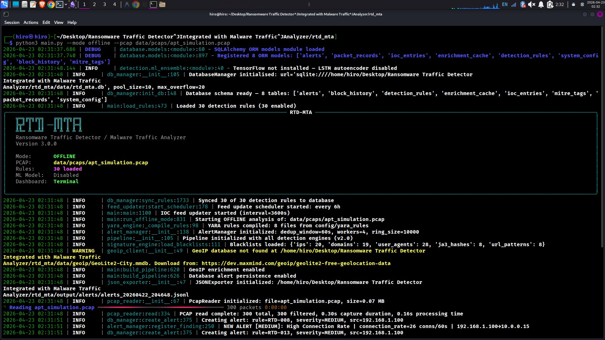
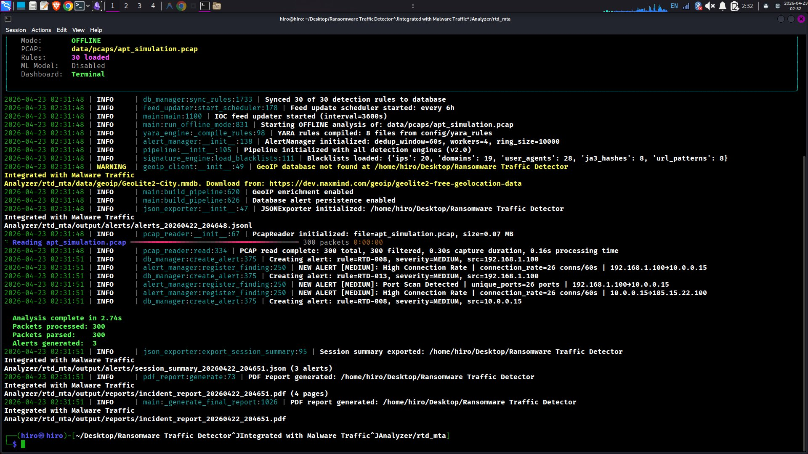

# RTD-MTA  Demo 2: SOC Analyst Terminal Dashboard (TUI Mode)

**Tool:** Ransomware Traffic Detector / Malware Traffic Analyzer (RTD-MTA v3.0.0)  
**Demo Run Date:** 2026-04-23  
**Analyst:** Manjil Katuwal  
**Mode:** Offline PCAP / Terminal Dashboard Active

---

## The Point of This Demo

Demo 1 was about the detection engine / seeing all 9 engines fire, watching the deduplication logic work, and reading verbose DEBUG output. This one is different. This demo is about proving you understand what a working SOC analyst actually needs on their screen during a live incident. Not raw debug logs. A proper operational interface  threat feed, system gauges, top rules table  all updating live without touching a browser or logging into a SIEM.

**Command run:**

```bash
python3 main.py --mode offline --pcap data/pcaps/apt_simulation.pcap
```

No `--no-dashboard`. No `--verbose`. The tool defaults to TUI mode with INFO-level logging  exactly how an analyst would run it on shift.

---

## Screenshot 1  TUI Mode Startup

**What to look at:**

First thing  the banner. Compare `Dashboard: Terminal` (highlighted in yellow) against Demo 1 where it said `Dashboard: Off`. That single flag change is what activates the entire Rich-based TUI layer.

The init sequence is clean and fast. Key lines to note:

- **30 detection rules synced** to the database before a single packet is read
- **YARA rules compiled**  8 files from `config/yara_rules`
- **AlertManager** initialized with `dedup_window=60s`, `workers=4`, `ring_size=10000`
- **Pipeline v2.0**  all detection engines initialized in parallel
- **Blacklists loaded**  20 IPs, 19 domains, 28 user agents, 8 JA3 hashes, 8 URL patterns
- **GeoIP WARNING**  database not found (known gap, enrichment still enabled for when it's present)
- **JSONExporter** initialized  every session gets a `.jsonl` alert file automatically

The `ring_size=10000` on the AlertManager is the part that matters most for TUI mode. That's the shared buffer between the detection pipeline (producer) and the TUI render thread (consumer). The pipeline never waits on the dashboard. If the terminal lags on a slow machine or the screen is too small to render a frame, the detection engines keep running, alerts keep getting written to SQLite and JSON, and the ring holds up to 10,000 events until the TUI catches up. Detection is never the bottleneck  the UI is just a view.

The PCAP loads at `0.07 MB`, 300 packets, and the reader initializes in milliseconds. The progress bar at the bottom (`Reading apt_simulation.pcap ━━━━ 300 packets 0:00:00`) confirms everything parsed cleanly.

---

## Screenshot 2  Analysis Complete


**What happened:**

The full pipeline ran and surfaced three alerts  all visible now at INFO level without any debug noise. In order:

```
NEW ALERT [MEDIUM]: High Connection Rate   | 192.168.1.100 → 10.0.0.15      | 26 conns/60s  (RTD-008)
NEW ALERT [MEDIUM]: Port Scan Detected     | 192.168.1.100 → 10.0.0.15      | 26 ports       (RTD-013)
NEW ALERT [MEDIUM]: High Connection Rate   | 10.0.0.15     → 185.15.22.100  | 26 conns/60s  (RTD-008)
```

That's a complete lateral movement and C2 chain in three lines. Read top to bottom: internal host scans another internal host → same host gets hit with a high connection rate flood → then the target turns around and starts talking to an external IP at the same rate. That progression  recon, compromise, external beacon  is exactly the pre-ransomware deployment pattern RTD-MTA is built to catch.

**Final numbers:**

```
Analysis complete in 2.74s
Packets processed: 300
Packets parsed:    300
Alerts generated:  3
```

**Output artifacts written automatically:**

- `session_summary_20260422_204651.json`  machine-readable alert log (3 alerts)
- `incident_report_20260422_204651.pdf`  4-page PDF report, zero analyst effort required

---

## SOC Level Notes

**L1  Operational view:**

TUI mode is the real operational mode. `--no-dashboard` is for debugging and log collection. When you're on a monitoring shift, this is what you run. The dashboard gives you the threat feed and system telemetry in one terminal window. The INFO-only output means your screen shows what matters  actionable alerts  not 500 lines of deduplication counters. The PDF drops itself automatically when the threshold is crossed. You close the session, attach the PDF, escalate.

**L2  Reading the alert chain:**

Three alerts, two rules (RTD-008 and RTD-013), two source IPs. RTD-013 (Port Scan) on 192.168.1.100 means recon. RTD-008 (High Connection Rate) on the same source, same target, same timeframe means the recon was aggressive  26 connections in 60 seconds is not a misconfigured device. Then RTD-008 fires again on 10.0.0.15 toward 185.15.22.100. That host was the target of the scan. Now it's beaconing externally. MITRE-wise: T1046 → T1071. The MITREMapper has 32 mappings loaded  those technique IDs should be tagged in the PDF report.

**L3  Why TUI over raw logs:**

The Rich TUI runs in its own thread with a non-blocking consumer on the ring buffer. The packet parser, all detection engines, the deduplication logic, the SQLite writer, and the JSON exporter all run independently of the dashboard. Removing `--verbose` here wasn't just cosmetic  it means the log handler isn't flushing thousands of DEBUG lines to stdout, which reduces I/O pressure on the terminal. The TUI gets clean screen real estate to render its panels. In a live-capture scenario against a real interface under load, this design means the detection pipeline operates at full speed regardless of what the dashboard thread is doing.

---

_Report based on live terminal output captured on 2026-04-23._
